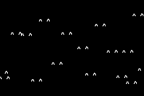

# CAT Bouncers
An exercise to learn about functions and classes.

This is a simple game where you press A and cat ear will show up and floating around the screen like
balls.

https://meomeodestroyer.github.io/bouncers/

Please find instructions in [instructions.md](instructions.md).
